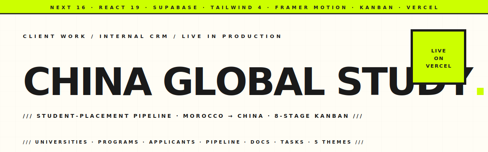

<p align="center">
  <picture>
    <source media="(prefers-color-scheme: dark)" srcset="assets/hero-banner-dark.svg" />
    
  </picture>
</p>

<p align="center">
  <a href="https://github.com/hatimhtm/china-global-study/actions/workflows/ci.yml"></a>
  
  
  
  
  
</p>

<p align="center">
  <em>Internal student-placement CRM for <strong>China Global Study</strong> — the parent agency placing Moroccan and North-African students into Chinese universities. ~4,000 LOC of Next.js 16 (App Router) on Supabase, with an 8-stage drag-and-drop kanban, document tracking, payment-status state machine, and five swappable themes. Built for them on a freelance engagement, shipped to production, in daily use.</em>
</p>

---

### `/// THE BRIEF`

CGS runs a student-placement business by hand — universities tracked in spreadsheets, applicants in WhatsApp threads, payment status in heads. The brief: replace all of that with one dashboard the agency could actually open every day. Specifically

1. **One pipeline view, end to end** — every applicant lives in one of eight stages from `Inquiry` to `Enrolled`, drag-and-drop between columns, no spreadsheet exports.
2. **Money where it belongs** — each application tracks `amount_paid_cny` against `service_fee_cny` with auto-computed `Paid` / `Partial` / `Unpaid` status. CNY ↔ MAD conversion baked into program totals.
3. **Five themes, one dashboard** — the agency's principal works late, so the UI ships with Obsidian Dark, Warm Cream, Sapphire, Jade, and Vivid Orange themes. Pick one, it sticks.
4. **Document-state at a glance** — every application has its own document set (passport · transcript · diploma · medical · visa · admission letter · …) cycling through `Pending → Received → Verified → Expired` with a single tap.

---

### `/// HIGHLIGHTS`

| | |
|---|---|
| **8-stage kanban pipeline** | `@hello-pangea/dnd` for physics-y drag between status columns; optimistic UI, status updates write back to Supabase live |
| **Supabase as the entire backend** | Seven tables (universities · programs · applicants · applications · documents · tasks · cities), referential cascades, status enums enforced at the DB layer |
| **Payment-status state machine** | `amount_paid_cny` vs `service_fee_cny` auto-derives `Unpaid` / `Partial` / `Paid` — plus a force-paid override for discounts and special offers |
| **Five fully-themed UIs** | CSS-variable theming, theme persists to localStorage, every component reads `var(--bg-primary)` etc. — status badges use `color-mix()` so they adapt per theme without hard-coded colors |
| **Skeleton loading + unified empty states** | `<Skeleton/>`, `<KanbanSkeleton/>`, `<TableSkeleton/>`, `<GridSkeleton/>` replace spinners; one `<EmptyState/>` component with icon + title + description + action used across every list view |
| **Refined motion** | Modal/Drawer use viralos's signature `cubic-bezier(0.16, 1, 0.3, 1)` ease; ESC-to-close on both; `active:scale(0.98)` press feedback on buttons; cards lift on hover |
| **Next.js 16 App Router** | Section layouts, server components for data-heavy pages, client islands for the kanban and modals |
| **Tutorial overlay** | First-run guided tour with anchored tooltips so agency staff can onboard themselves |
| **Currency-aware programs** | Programs store fees in CNY and auto-compute MAD at `DEFAULT_MAD_RATE = 1.38` — tunable in [`src/lib/constants.ts`](src/lib/constants.ts) |
| **Env-gated soft auth** | Landing page accepts a phrase from `NEXT_PUBLIC_AUTH_PHRASE`; pass-through to dashboard via localStorage. Not real auth — Supabase RLS does the actual gating |

---

### `/// PAGES`

- **`/`** — auth gate (theme-aware brand, phrase entry)
- **`/dashboard`** — overview · stats · featured programs · recent activity
- **`/dashboard/pipeline`** — the kanban: every applicant, every stage, drag to move
- **`/dashboard/universities`** — partner-institutions registry with featured flag and scholarship %
- **`/dashboard/cities`** — Chinese-city guides (climate · cost-of-living · essential-apps · accommodation)
- **`/dashboard/documents`** — per-application document tracker with cycling status pills
- **`/dashboard/tasks`** — pre-departure · arrival · documentation · general task buckets
- **`/dashboard/settings`** — agency profile · theme picker · currency rate · tutorial replay

---

### `/// STACK`

```
Next.js 16    · React 19 · TypeScript 5
Tailwind 4    · framer-motion 12 · lucide-react
Supabase      · @hello-pangea/dnd (kanban DnD)
Vercel        · App Router · server + client components
```

---

### `/// PROJECT LAYOUT`

```
src/
├── app/
│   ├── layout.tsx                root layout, theme provider
│   ├── page.tsx                  auth gate (env-driven phrase)
│   ├── globals.css               theme CSS variables + status-badge utilities (color-mix)
│   └── dashboard/
│       ├── layout.tsx            sidebar + navbar wrapper
│       ├── page.tsx              overview, stats, featured programs
│       ├── pipeline/page.tsx     8-stage kanban (dnd) + financial drawer
│       ├── universities/page.tsx
│       ├── cities/page.tsx
│       ├── documents/page.tsx
│       ├── tasks/page.tsx
│       └── settings/page.tsx     agency profile + theme picker
├── components/
│   ├── layout/{Navbar,Sidebar}.tsx
│   ├── ui/{Modal,SlideDrawer,Tutorial,EmptyState,Skeleton}.tsx
│   └── dashboard/NewEntryModal.tsx
├── lib/
│   ├── supabase.ts               anon-key client
│   ├── themes.ts                 5 themes × ~25 CSS vars
│   └── constants.ts              enums + tutorial steps + MAD rate
└── types/
    └── index.ts                  domain types (University · Program · …)

supabase-schema.sql               run this in the SQL editor on a fresh project
```

---

### `/// LOCAL DEV`

```bash
# 1 — Spin up a Supabase project, paste supabase-schema.sql into SQL Editor, run it.
# 2 — Copy env template and fill in your project URL + anon key + auth phrase:
cp .env.example .env.local
# 3 — Install & run:
npm install
npm run dev      # http://localhost:3000
npm run build    # next build (production bundle)
npm run lint     # eslint
```

---

### `/// STATUS`

🟢 **Live, in production, in daily use by the agency.** Engagement complete; this repo is the public archive of the build.

---

<p align="center">
  <a href="https://hatimelhassak.is-a.dev"></a>
  <a href="https://cal.com/hatimelhassak/engineering-discovery"></a>
  <a href="https://www.linkedin.com/in/hatim-elhassak/"></a>
  <a href="mailto:hatimelhassak.official@gmail.com"></a>
</p>

<p align="center">
  <code>///&nbsp;&nbsp;OPEN FOR NEW WORK&nbsp;&nbsp;///&nbsp;&nbsp;CONTRACT &amp; FREELANCE&nbsp;&nbsp;///&nbsp;&nbsp;REMOTE WORLDWIDE&nbsp;&nbsp;///</code>
</p>
